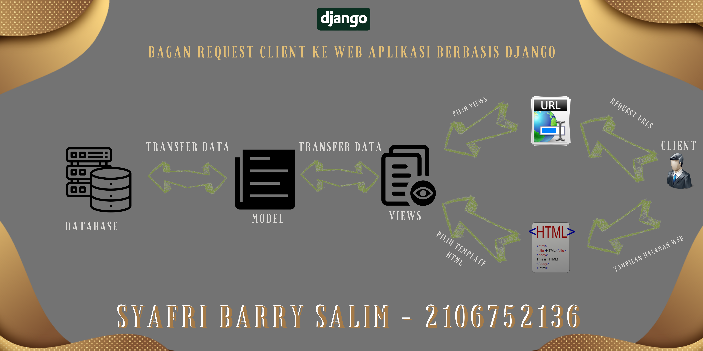

# Tugas 2 Pengenalan Aplikasi Django dan Models View Template (MVT) pada Django

Pemrograman Berbasis Platform (CSGE602022) - diselenggarakan oleh Fakultas Ilmu Komputer Universitas Indonesia, Semester Ganjil 2022/2023 

## Nama : Syafri Barry Salim
## NPM  : 2106752136
#

### Link Heroku
sbarrystugas2pbp.herokuapp.com/katalog
#
### Bagan request client ke web aplikasi berbasis Django

#
### Kenapa menggunakan virtual environment? Apakah kita tetap dapat membuat aplikasi web berbasis Django tanpa menggunakan virtual environment?
#

Penjelasan :

Virtual environment atau venv merupakan environment manager dari python yang berfungsi untuk membuat sebuah scope virtual yang terisolasi. Terisolasi artinya tertutup dan tidak bisa diakses dari dunia luar. contohnya seperti kita membuat sebuah proyek aplikasi django dengan versi 15.7 lalu beberapa waktu kemudian django melalukan update dengan versi terbaru 16, kemudian kita mengupgrade ke versi terbaru tersebut Akan tetapi, aplikasi yang sudah kita buat tidak bisa berjalan dengan modul versi baru ini, karena banyak perubahan fungsi dan lain-lain. maka dari itu kita membutuhkan virtualenv agar masing masing aplikasi memeliki modulnya sendiri.

kita tetap bisa membuat aplikasi web berbasis Django tanpa menggunakan virtual environment, akan tetapi jika terjadi pembaruan versi terbaru maka akan menimbulkan tidak singkron dari local storage file ke aplikasi web berbasi django seperti heroku.app.

### Jelaskan bagaimana cara kamu mengimplementasikan poin 1 sampai dengan 4 di atas.

Penjelasan : 

## views.py
pada file views.py saya mengimplementasikan views.py dengan mengambil semua data yang ada di database kemudian saya menambahkan beberapa variabel penting seperti nama dan npm. Variabel tersebut disimpan dalam scope context yang selanjutnya dibawa ke dalam fungsi render sebagai paramater tambahan yang akan digunakan di katalog.html.

## urls.py
pada file urls.py yang terdapat di folder project_django Saya mengimplementasikan urls.py dengan menambahkan path('katalog/', include('katalog.urls')). Hal tersebut dilakukan guna untuk melakukan route '/katalog' dengan katalog/urls.py agar function show_katalog yang ada di katalog.views.py dapat dijalankan. 

## katalog.html
Ketika mengimplementasikan katalog.html, program akan melakukan render di katalog.html, kemudian saya memanggil isi variabel nama dan npm yang terdapat di views.py dengan mengimplementasikannya menggunakan variabel "{{nama}}" dan "{{npm}}". Selain itu, saya juga menggunakan for loop untuk mengambil data-data yang disimpan pada list di database.

## deploy
Ketika mengimplementasikan deploy, saya menghubungkan (connect) antara repository github saya ke akun heroku dengan cara memasukkan variabel HEROKU_APP_NAME dan HEROKU_API_KEY di github secrets --> actions agar dapat connect secara realtime ke heroku dan bisa langsung  di deploy melalui github.

