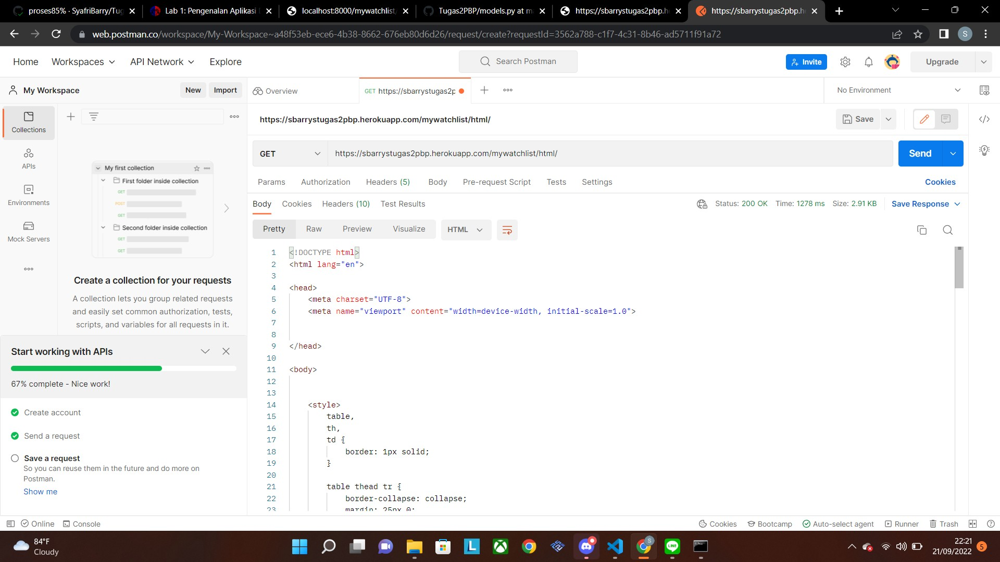
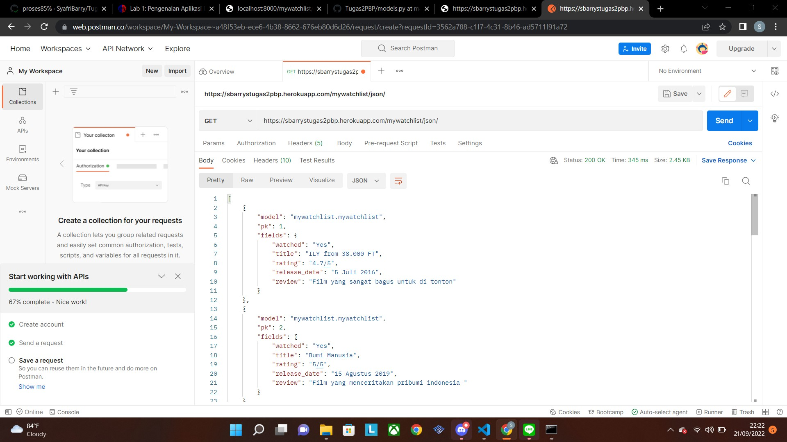
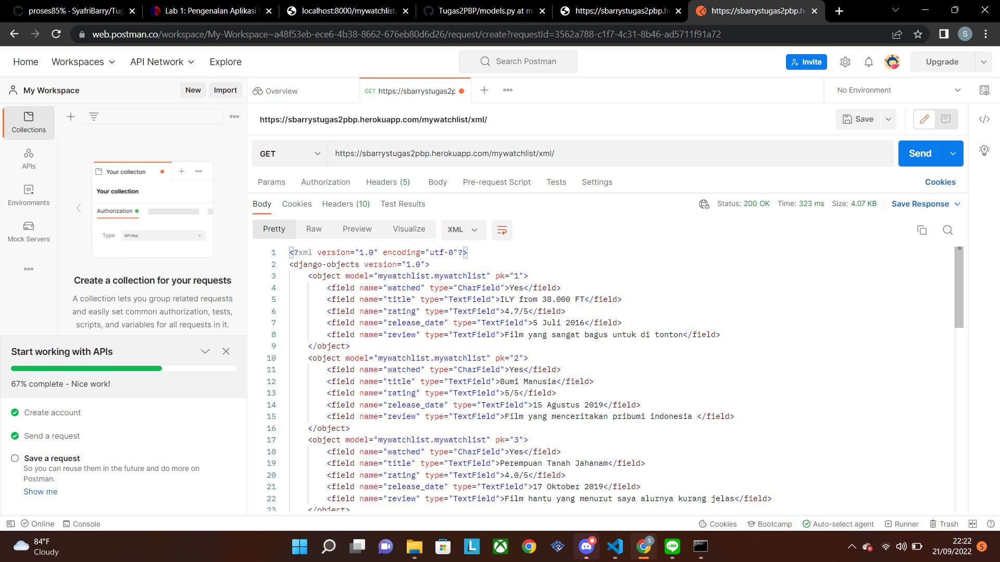

# Tugas 3: Pengimplementasian Data Delivery Menggunakan Django

Pemrograman Berbasis Platform (CSGE602022) - diselenggarakan oleh Fakultas Ilmu Komputer Universitas Indonesia, Semester Ganjil 2022/2023 

## Nama : Syafri Barry Salim
## NPM  : 2106752136
#

### Link Heroku
1. https://sbarrystugas2pbp.herokuapp.com/mywatchlist/html/
2. https://sbarrystugas2pbp.herokuapp.com/mywatchlist/json/
3. https://sbarrystugas2pbp.herokuapp.com/mywatchlist/xml/
#

### Jelaskan perbedaan antara JSON, XML, dan HTML
#

Penjelasan :

## JSON 
(Java Script Object Notation) adalah sebuah format yang digunakan untuk menyimpan, membaca, serta menukar informasi dari web server sehingga dapat dibaca oleh para pengguna. Biasanya, file JSON berisikan teks dan file berekstensi .json. JSON ini berbeda dengan XML namun keduanya memiliki fungsi yang serupa.

JSON ini sendiri terdiri dari dua struktur atau bagian. Yang pertama adalah kumpulan value yang saling berpasangan contohnya seperti object. Struktur kedua adalah kumpulan value yang berurutan seperti misalnya array. Selain itu, JSON dapat digunakan oleh bahasa pemrograman lain seperti PHP, Python, C++, dan Ruby
#

## XML

Extensible Markup Language adalah bahasa komputer yang dibuat oleh World Wide Web Consortium (W3C) untuk menyederhanakan proses pertukaran dan penyimpanan data. Hal ini disebabkan keunikan dan perbedaan sistem yang digunakan oleh masing-masing server yang terhubung ke internet. Maka dari itu, diperlukan adanya standardisasi  proses transfer data antar server.

XML akan menyimpan data dalam format teks yang sederhana. Jadi, data tersebut akan dapat dimengerti oleh server yang menerima data tanpa perlu perubahan atau modifikasi apapun. Hal ini tentunya sangat memudahkan dalam penyimpanan dan pengiriman data antar server.
#

## HTML
Hypertext Markup Language adalah bahasa markup yang digunakan untuk membuat halaman website. Isinya terdiri dari berbagai kode yang dapat menyusun struktur suatu website.

HTML terdiri dari kombinasi teks dan simbol yang disimpan dalam sebuah file. Dalam membuat file HTML, terdapat standar atau format khusus yang harus diikuti. Format tersebut telah tertuang dalam standar kode internasional atau ASCII (American Standard Code for Information Interchange).
#

### Jelaskan mengapa kita memerlukan data delivery dalam pengimplementasian sebuah platform.
#
dalam membuat suatu platform kita akan menyajikan sebuah data, termasuk penerapan model dalam aplikasi atau sistem, visualisasi, dan lain sebagainya maka dari itu data delivery sangat penting dalam pengimplementasian sebuah platform. 
 

## Jelaskan bagaimana cara kamu mengimplementasikan checklist di atas
#
1. Membuat suatu aplikasi baru bernama mywatchlist di proyek Django Tugas 2 pekan lalu 
2. membuat 'path('mywatchlist/', include('mywatchlist.urls'))' pada folder project_django Lalu, menambahkan 'mywatchlist' pada 'installed app' yang terdapat pada filesetting.py. setelah itu  menambahkan 'path('html/', show_mywatchlist, name='show_mywatchlist') pada file urls.py di folder mywatchlist
3. membuat class model baru bernama MyWatchList pada file models.py' dengan variabel watched, title, rating, release_date, dan review. Selanjutnya melakukan migrasi dengan menggunakan command python manage.py makemigrations dan python manage.py migrate 
4. Membuat folder fixtures kemudian membuat file 'initial_mywatchlist_data.json' lalu membuat object sebanyak 10 data dan ditambahkan untuk objek MyWatchList serta melakukan loaddata dengan perintah python manage.py loaddata initial_mywatchlist_data.json
5. Membuat parameter request pada views.py untuk menampilkan data dalam bentuk HTML, XML, dan JSON serta melakukan routing dengan menambahkan path url pada urls.py
6. Terakhir melakukan git add, git commit dan git push origin main agar ter push pada github dan terdeploy pada herokuapp

### SCREENSHOT POSTMAN
# HTML

#
# JSON

#
# XML

